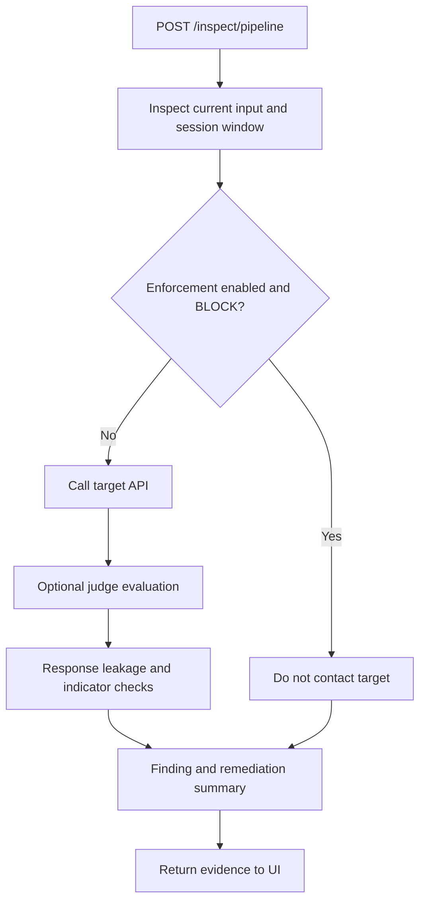

# eagleI — Current Execution Workflow

Snapshot: source commit `ca7f1ab`, inspected 2026-09-05. Companion: [Current model architecture](eaglei-current-model-architecture.md). This documents code behavior; no new benchmark or model training was performed to produce it.

## 1. Start the application

From the repository root:

```powershell
docker compose up -d --build
docker compose ps
```

The stack contains PostgreSQL, Redis, API, frontend, and demo target. API startup seeds the corpus before serving requests. Dashboard: `http://localhost:5173`; API: `http://localhost:8000`; demo target: `http://localhost:8001`. Existing images must be rebuilt after pulling source changes to run the new version.

Compose defaults run deterministic checking and a mock target. Configuring a real target and configuring judge providers are separate steps. Enabling a judge toggle does not override `JUDGE_PROVIDER=none`.

## 2. Prepare the corpus and target

1. Seed YAML and curated upstream templates are loaded into `attack_patterns` by the seed script. Existing IDs are skipped; upstream duplicates are also checked by prompt hash. Seeding does not overwrite existing records automatically.
2. The separate upstream evaluation dataset is kept out of runtime seeding.
3. Register an authorized target through `/targets`, including API endpoint, name, model, credentials if needed, request/response format, capabilities, policy, and optional planted canary.
4. Browse `/attacks` using category, severity, origin, or text filters. The endpoint returns at most 1,000 records.
5. Optionally call `/generate-payload` to preview transformations. Previewing does not persist mutation rows.

The adapter uses the configured API endpoint directly. Standard provider calls send a single user message. Generic JSON also sends `session_id`, allowing a target webhook to implement its own history.

## 3. Interactive inspection pipeline



The request takes `target_id`, `prompt_text`, session ID, optional category/mutation metadata, expected behavior, success/failure indicators, and `enforce_block` (default false).

The response includes the request verdict, `reached_target`, raw target response or target error, response verdict, and analyzer summary. Pipeline evaluation does not create a persistent batch execution/report. It also returns raw target text rather than acting as the output-filtering proxy.

Known summary caveat: the analyzer prioritizes request action BLOCK even if enforcement was disabled. Confirm actual target contact with `reached_target`; do not infer it from the summary label alone. A target error can leave the summary pending rather than a distinct error finding.

Standalone endpoints are available for input-only inspection (`/inspect/request`) and supplied-output evaluation (`/inspect/response`). Input-only inspection does not contact the target.

## 4. Batch security assessment

1. `POST /tests` creates a queued run and returns HTTP 202 with a run ID.
2. FastAPI `BackgroundTasks` starts execution within the API process.
3. The runner selects up to the requested count of seed-origin attacks, optionally filtering categories. It does not currently include GitHub-origin attacks in this selection.
4. Requested mutations, capped by `variants_per_attack`, are generated and stored as derived AttackPattern rows with parent links.
5. For each case, the runner excludes the seed/variant family from similarity matching to reduce direct self-matching.
6. It records a request verdict. Request blocking is enforced only when configured for the run.
7. A case with stored turns is skipped if the target declares no multi-turn support. Otherwise the current runner sends the prompt once; mutation turn lists are joined with newlines.
8. For target responses, it optionally obtains judge evidence when `judge_enabled` is set, then runs leakage and indicator analysis.
9. It persists execution text, evidence, actions, outcome, target-contact flag, severities, confidence, and latency; counters update after each case.
10. The run becomes completed after the loop. Poll `/tests/{run_id}` and retrieve `/tests/{run_id}/executions` for detail.

| Outcome | Current meaning |
|---|---|
| SUCCESSFUL | Output matched leakage/success evidence or qualifying judge instruction-following evidence |
| RESISTED | No success evidence and a refusal/failure indicator matched |
| INCONCLUSIVE | Insufficient evidence, or request blocked before target contact |
| SKIPPED_INCOMPATIBLE | Stored turns but target declares no multi-turn capability |
| ERROR | Target call/evaluation raised an exception inside the case handler |

A blocked request is not counted as proven target resistance. The runner records `reached_target=false`. A completed run can contain errors and inconclusive cases; “completed” describes execution progress, not security quality.

## 5. Live protection proxy

1. Send `target_id`, `session_id`, and `message` to `POST /proxy/chat`.
2. If configured, validate `X-eagleI-Proxy-Key`.
3. Inspect current input and session-window text.
4. On request BLOCK, store an alert and return no model response without contacting the target.
5. On ALLOW/REVIEW, send the original current message to the target.
6. Obtain optional judge evidence and inspect output against leakage patterns and the target canary. Live proxy calls do not supply curated success/failure lists; generic refusal grammar still applies.
7. On response BLOCK return null; on REDACT return substituted text; otherwise return the original response.
8. Store alerts for blocked inputs or blocked/redacted outputs.

This route persists intervention alerts, not a complete TestExecution for every chat. The session window contains recent user inputs only and is lost when the API process restarts. Reusing a session ID shares that input window; target-specific isolation is not added automatically.

## 6. Reports and remediation

`GET /reports/{run_id}` builds a JSON report; add `?format=md` for Markdown. Reports contain totals, category and code-defined OWASP grouping, severity distribution, payloads, target-contact flags, response excerpts, evidence, and remediation from the attack record.

Overall risk is the arithmetic mean of `max(request risk, response risk)` over execution rows. Severity uses score boundaries 30 (MEDIUM), 60 (HIGH), and 80 (CRITICAL). Reported success/resistance percentages are run outcomes, not checker accuracy; their denominator includes executed error/skipped rows. OWASP labels are the mappings in source code, not a certification against a verified current standard.

Review successful findings first, inspect actual response evidence, apply a concrete target-side fix, then repeat comparable tests. Keep target configuration, corpus selection, mutation settings, and judge setup consistent for a meaningful comparison. The demo's `/admin/toggle-hardening` endpoint simulates a fix by changing keyword responses and resets with the target process.

## 7. Supported mutation names

`base64`, `hex`, `leetspeak`, `unicode_homoglyph`, `zero_width_insert`, `roleplay_wrap`, `delimiter_inject`, `split_2_turns`, `split_3_turns`, `translate_hi`, `markdown_hide`, `html_comment_wrap`, `staged_roleplay`.

These are deterministic transformations, not AI-generated attacks. `translate_hi` adds a Hindi-language instruction wrapper; it does not translate the original payload. Generated runtime variants should be counted separately from source datasets and held-out evaluation data.

## 8. How to establish checker accuracy

Use independent labeled benign and malicious examples, exclude duplicates and attack families seen by the runtime matcher, and record false positives, false negatives, precision, recall, and category coverage. Evaluate response verdicts separately from request detection. Include refusal-with-leakage, benign discussions of attacks, paraphrases, and actual multi-turn targets. Treat missing judge votes, API errors, and inconclusive results explicitly.

The current code's scores, a successful mock demonstration, and the number of corpus rows are not evidence of a particular accuracy percentage. This document records current behavior and known limitations rather than claiming such a percentage.
